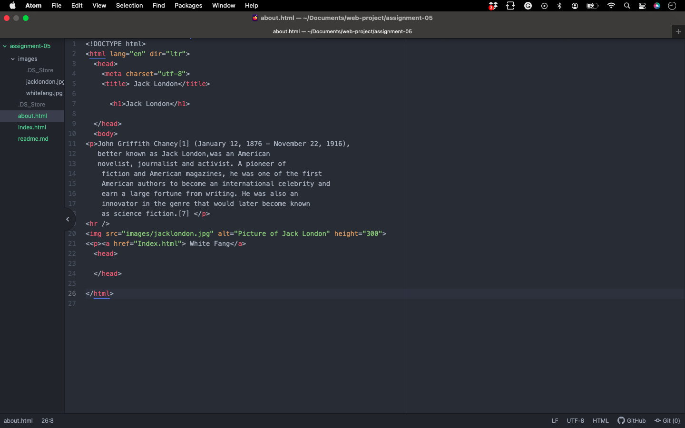

# My Space

I looked back in time at myspace.com december 19th 2006. The 2006 version is simple and easy to use. it has the heading on the top with the options and a few boxes with extra stuff to look at in the body. The newest version of myspace has a small heading with options going down the side and its less busy. There is more going on in the new site you scroll for a long time to get to the bottom. 
