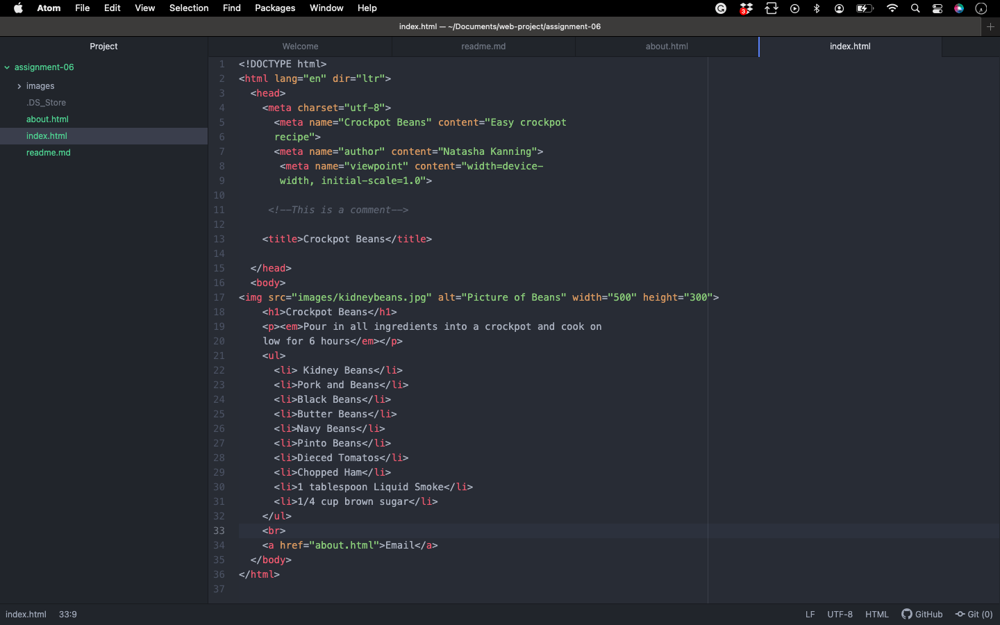

structural markup is the elements that you use to describe both headings ad paragraphs

semantic markup provides extra info such as where emphasis is placed in a sentence. something you have written is a quotation, the meaning of an acronyms ect
