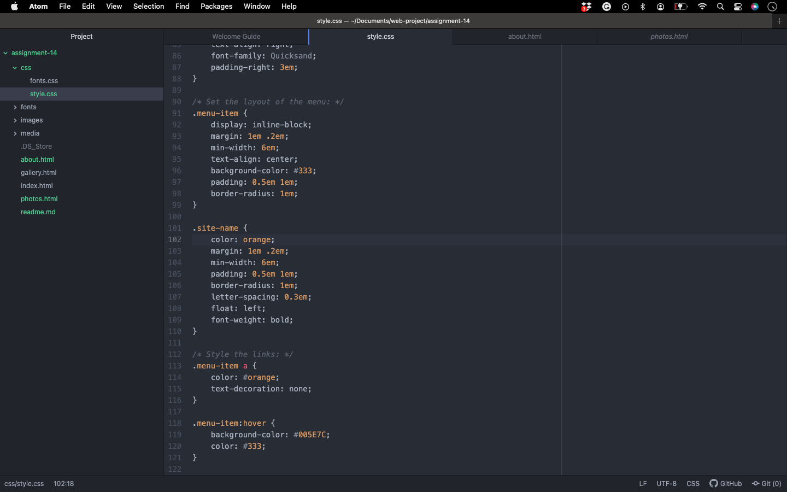

How did your user testing sessions go? It
went really good they both liked the website.
What changes (if any) did you make to your website based on the user feedback you
received?
I changed my background color from blue to
grey and I changed the red lettering in
my navbar from red to orange baised on user feedback. 
