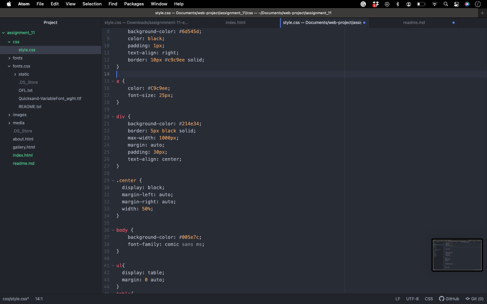

Typeograohy is the art and technique of arranging type to make writtten launguage legible.

Incase a browser doesn't support your original font

A system font or a websafe font is one that's alreayd on most usesers devices 
